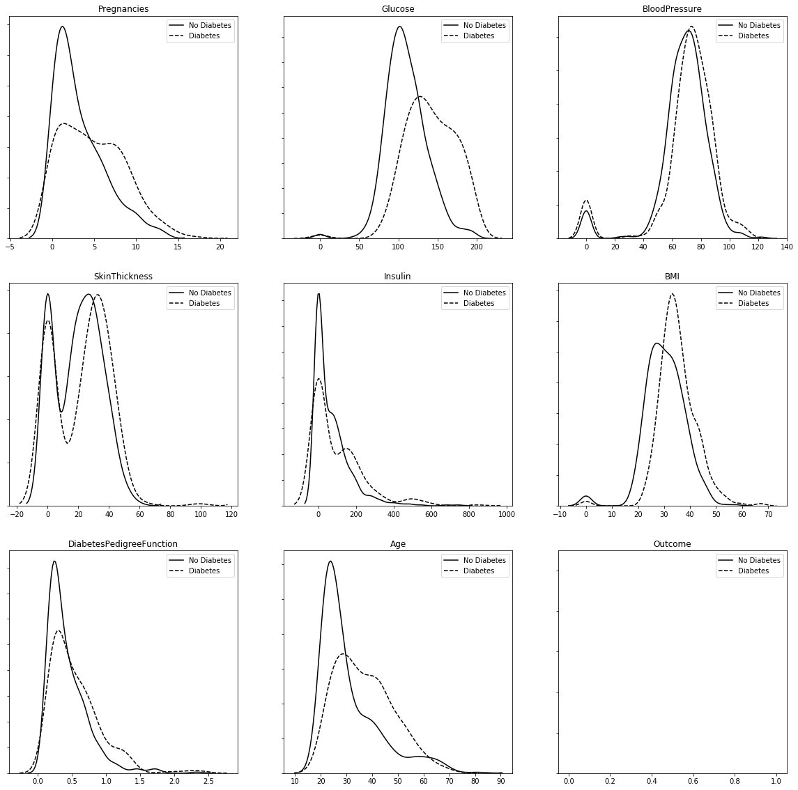

# Predicting Diabetes Project

Diabetes prediction project

## Table of contents

- [Introduction](#introduction)
- [Technologies](#technologies)
- [Goal](#goal)
- [Dataset](#dataset)
- [Methodology](#methodology)

## Introduction

This project is from the second chapter of the book [Neural Network Projects with Python](https://www.packtpub.com/big-data-and-business-intelligence/neural-network-projects-python?utm_source=github&utm_medium=repository), published by Packt. The model is built using a multilayer perceptron (MLP) that can predict whether a patient is at risk of diabetes.

## Technologies

Python

## Goal

The goal for this analysis is to be able to predict the salary for a job position based on certain attributes.

## Dataset

The dataset used comes from the Pima Indians Diabetes dataset, as provided by the National Institute of Diabetes and Digestive and Kidney Diseases (and hosted by Kaggle). The Pima Indians diabetes dataset consists of diagnostic measurements collected from a sample of female Pima Indians, along with a label indicating whether the patient developed diabetes within five years of the initial measurement.
The data includes 768 observations and the following variables:
 
_Pregnancies:_ Number of previous pregnancies
 
_Glucose:_ Plasma glucose concentration
 
_BloodPressure:_ Diastolic blood pressure
 
_SkinThickness:_ Skin fold thickness measured from the triceps
 
_Insulin:_ Blood serum insulin concentration
 
_BMI:_ Body mass index
 
_DiabetesPedigreeFunction:_ A summarized score that indicates the genetic predisposition of the patient for diabetes, as extrapolated from the patient's family record for diabetes
 
_Age:_ Age in years
 
_Outcome:_ The target variable we are trying to predict, 1 for patients that developed diabetes within five years of the initial measurement, and 0 otherwise

## Methodology

1. _Exploratory Analysis:_ Created histograms and plot density to understand the kind of data we are working with. 
     
     

2. _Data Preprocessing:_ Checked if there are any missing values, displayed the statistical summany, performed the data standardization and split the data into training, testing and validation sets..  
    
    
    

3. _Model Building and Evaluation:_ Built a multilayer perceptron (MLP) that can predict whether a patient is at risk of diabetes using Keras. For this project, we used 2 hidden layers. The first hidden will have 32 nodes, and the input dimensions will be 8 (because there are 8 columns in X_train). The second layer will have 16 nodes. The last layer will be the output layer, this layer has only one single node, as we're dealing with binary classification here. Used the fit function to train the model. Tested the model and got 92.67% training accuracy and 76.62% testing accuracy. Visualized the confusion matrix and ROC Curve. 
     
     
